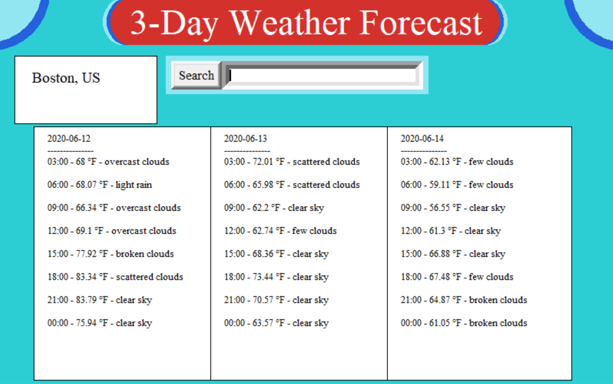

# 3 Day Weather Forecast App

 A program that takes in the name of a city from the user, and gives the temperature and weather for the rest of today and the next two days in UTC time.
      

## Table of Contents
- [About](#about)
- [Getting Started](#getting_started)
- [How to Use](#usage)
- [Authors](#authors)
## About 
This program was created in order to display and improve my skills in programming and in API authorization. The program itself was written in its entirety over the span of about three days.

## Getting Started 
What you will need to run this program: 
- <em>Python</em>- To run this program, you must have some way to run a .py file. Also, this program was written using python 3.8.3, and has not been tested using any previous version. You must also install <em>requests</em> using pip to properly use the program.
- <em>openweathermap API</em>- It is imperative to obtain an API key from <a href="https://openweathermap.org/">openweathermap.org</a> by making a free account and getting a personal key. There will be a place to insert your key at the top of the program's code.
## How to Use 
After installing and adding everything necessary, all you need to do is run the program, enter the name of a city, and the program will give you the weather forecast for the rest of today and the next two days in UTC time. Almost every major city is compatable with this program.
## Author 
[@AlexHettle](https://github.com/AlexHettle) - Sole author of project
